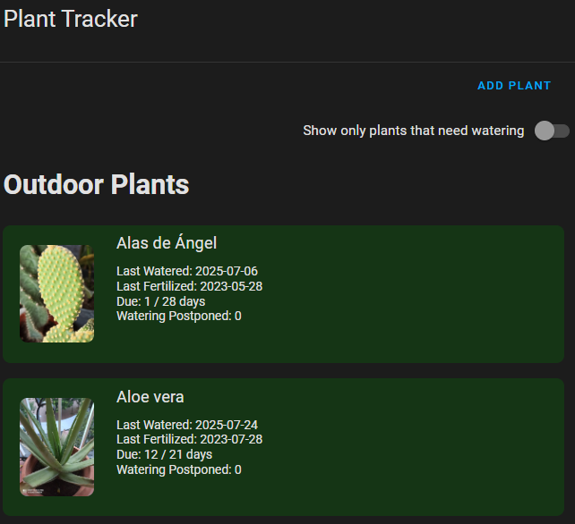
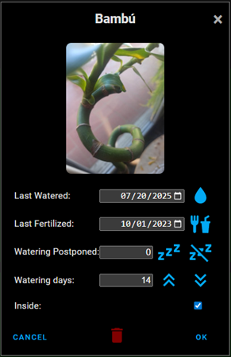

# 🌿 Plant Diary Card for Home Assistant

**Plant Diary** is a custom integration and Lovelace card for [Home Assistant](https://www.home-assistant.io/) that helps you manage and monitor your houseplants. Track when each plant was last watered or fertilized, define care intervals, and visualize everything with a custom card.

This work has been inspired by [Plant tracker for Home Assistant](https://github.com/mountwebs/ha-plant-tracker).

## Features

- **Companion Lovelace Card**
  - Shows days since last watering and fertilizing
  - Supports customizable images for each plant
  - Shows each plant’s watering status with intuitive color codes:
    - 🔵 Blue: watered today
    - 🟢 Green: within watering interval
    - 🔴 Red: past watering interval
    - 🟠 Orange: within postponed watering interval
  - Option to show only plants that currently need watering
  - Quick access to edit plant details via popup dialog

# 🖥️ Lovelace Card

Visualize your plants and their watering status using a custom Lovelace card.

## Preview

### Plant Diary Card



_Overview of multiple plants and their watering status._

### Edit Plant Popup



_Popup dialog for editing plant details such as watering schedule and last watered date._

## Installation

1. Download the `ha-plant-diary-card.js` file and place it in your `config/www/plant_diary` directory: config/www//plant_diary/ha-plant-diary-card.js
2. Add the resource to your dashboard via **Settings > Dashboards > Resources**:

```yaml
URL: /local/plant_diary/ha-plant-diary-card.js
```

3. Create a Dashboard using the Sidebar layout
4. Click Add Card, scroll down to Manual and paste the following code

```yaml
type: custom:ha-plant-diary-card
```

## Adding Plant Images

You can add custom images for your plants to enhance the Lovelace card and UI experience.

1. Place your plant images in your Home Assistant `config/www/plant_diary/` directory.
   - The image filename **must** match the plant's name, e.g., `Monstera.jpg` for a plant named "Monstera".
   - Example path:
     `    config/www/plant_diary/Monstera.jpg`
     The Lovelace card and UI will use this image for the corresponding plant.

# 🐛 Issues & Feedback

If you encounter any issues or would like to suggest improvements:

- 📌 Open an issue on GitHub: [https://github.com/xplanes/ha-plant-diary-card/issues](https://github.com/xplanes/ha-plant-diary-card/issues)
- 🙌 Pull requests are welcome!

Please include logs or reproduction steps when reporting bugs.

# 🧠 Roadmap

Planned features and improvements for future versions:

- ✅ Lovelace card for visualizing plant data

Feel free to contribute to the roadmap or suggest new ideas!

## 📄 License

This project is licensed under the **MIT License**.
See the [LICENSE](LICENSE) file for full license text.

© 2025 [@xplanes](https://github.com/xplanes)
