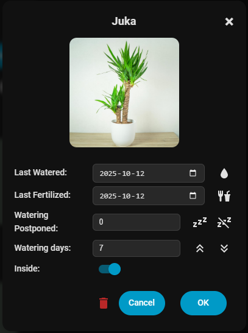
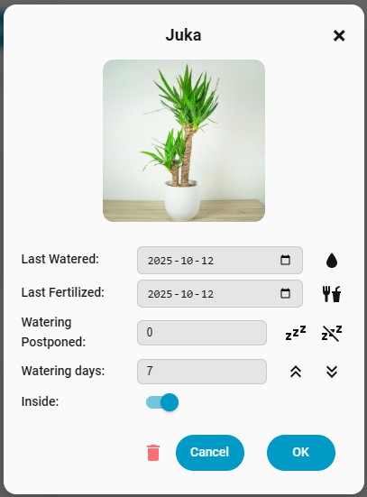

# 🌿 Plant Diary Card for Home Assistant

**Plant Diary Card** is a Lovelace card for [Home Assistant](https://www.home-assistant.io/) that helps you manage and monitor your houseplants. This card is used in combination with the [Plant Diary Integration](https://github.com/xplanes/ha-plant-diary).

This work has been inspired by [Plant tracker for Home Assistant](https://github.com/mountwebs/ha-plant-tracker).

# Features

- Shows days since last watering and fertilizing
- Supports customizable images for each plant
- Shows each plant’s watering status with intuitive color codes:
  - 🔵 Blue: watered today
  - 🟢 Green: within watering interval
  - 🔴 Red: past watering interval
  - 🟡 Yellow: within postponed watering interval
- Option to show only plants that currently need watering
- Quick access to edit plant details via popup dialog

# Preview

## Plant Diary Card


_Overview of multiple plants and their watering status._

## Edit Plant Popup




_Popup dialog for editing plant details such as watering schedule and last watered date._

# Installation

You can install this component in two ways: via [HACS](https://github.com/hacs/integration) or manually.

## Option A: Installing via HACS

### Plant Diary integration

1. Go to the HACS Integration Tab
2. Search the `Plant Diary` component and click on it.
3. Click Download button at the bottom of the page. A pop up will be shown informing you that the component will be installed in the folder `/config/custom_components/plant_diary`. Click Download.

### Plant Diary Card

1. Go to the HACS Integration Tab
2. Search the `Plant Diary Card` component and click on it.
3. Click Download button at the bottom of the page. A pop up will be shown informing you that the component will be installed in the folder `/config/www/community/ha-plant-diary-card`. Click Download. The JavaScript module will be automatically added to the Dashboard Resources (/hacsfiles/ha-plant-diary-card/ha-plant-diary-card.js).

## Option B: Manual Installation

### Plant Diary integration

1. Clone or download the GitHub repository: [ha-plant-diary](https://github.com/xplanes/ha-plant-diary)
2. Copy the `custom_components/plant_diary` folder to your Home Assistant `config/custom_components/` directory: config/custom_components/plant_diary
3. Restart Home Assistant.

### Plant Diary Card

1. Clone or download the GitHub repository: [ha-plant-diary-card](https://github.com/xplanes/ha-plant-diary-card)
1. Place the file `ha-plant-diary-card.js` in your `config/www/plant_diary` directory: config/www//plant_diary/ha-plant-diary-card.js
1. Add the resource to your dashboard via **Settings > Dashboards > Resources**:

```yaml
URL: /local/plant_diary/ha-plant-diary-card.js
```

# Configuration

### Plant Diary integration

1. Go to **Settings > Devices & Services > Devices > Add Device**.
2. Search for **Plant Diary** and add it.

### Plant Diary Card

1. Create a Dashboard using the Sidebar layout
2. Click Add Card and search for `Plant Diary Card`

# Adding Plant Images

You can add custom images for your plants to enhance the Lovelace card and UI experience.

1. Place your plant images in your Home Assistant `config/www/plant_diary/` directory.
   - The image filename **must** match the plant's name, e.g., `Monstera.jpg` for a plant named "Monstera".
   - Example path:
     `    config/www/plant_diary/Monstera.jpg`
     The Lovelace card and UI will use this image for the corresponding plant.

# 🐛 Issues & Feedback

If you encounter any issues or would like to suggest improvements:

- 📌 Open an issue on GitHub: [https://github.com/xplanes/ha-plant-diary-card/issues](https://github.com/xplanes/ha-plant-diary-card/issues)
- 🙌 Pull requests are welcome!

Please include logs or reproduction steps when reporting bugs.

# 🧠 Roadmap

Planned features and improvements for future versions:

- ✅ Lovelace card for visualizing plant data

Feel free to contribute to the roadmap or suggest new ideas!

# 📄 License

This project is licensed under the **MIT License**.
See the [LICENSE](LICENSE) file for full license text.

© 2025 [@xplanes](https://github.com/xplanes)
